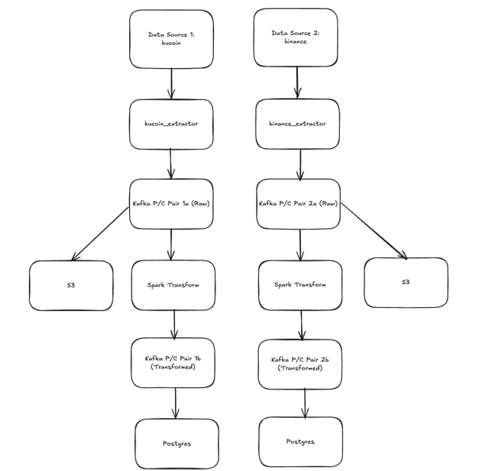

# Real time pipeline for extracting live crypto prices


## Objective

Provides a robust web server that streams live crypto prices from Binance and Kucoin

These data can be stored into Postgres as live updates to all crypto tickers.

## High Level Architecture



## Key Design Decisions

### 1. Async Extractors
- Web socket to stream from Binance and Kucoin WebSocket API
- Responsible for extracting crypto prices for both Binance and Kucoin. 
- 2 sources to maintain accuracy and completeness of data
- Produce to raw topics


### 2. Batcher
- Responsible for batching messages for Kucoin to be sent to the Kafka Broker
- Responsible for batch insertion into Postgres (TODO)
- Responsible for batch insertion into S3 (TODO)


### 3. Kafka Broker
- Raw topics: 'kucoin_raw_data' and 'binance_raw_data'
- Transformed topics: 'kucoin_transformed_data' and 'binance_transformed_data'


### 4. Transformer Consumer / Producer
- Consumer 1 consumes from raw topic to be uploaded to S3
- Consumer 2 consumes from raw topic for transformation
- Produces to transformed topics

### 5. S3 Uploader
- Responsible for batch uploads to S3 bucket

### 6. Loader Consumer / Producer
- Responsible for consuming from transformed topics
- Saves structured data to Postgres


## How to spin up locally
1. Start Zookeeper by navigating to directory where Kafka is installed
```commandline
bin/zookeeper-server-start.sh config/zookeeper.properties
```

2. Start Kafka by navigating to directory where Kafka is installed
```commandline
bin/kafka-server-start.sh config/server.properties
```

3. (Optional, for devs) Manual consume from a kucoin_raw_data topic to see the messages
```commandline
bin/kafka-console-consumer.sh \
  --bootstrap-server localhost:9092 \
  --topic kucoin_raw_data \
  --from-beginning \
  --property print.key=true \
  --property print.value=true \
  --property print.timestamp=true
```

### Other Issues
1. Data will be missing whenever web socket is closed. WebSocket API cannot retrieve historical data.
Possibly add a non-realtime pipeline to ingest missing data?
2. 